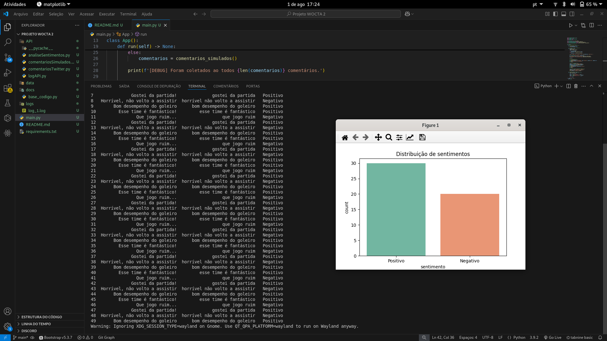
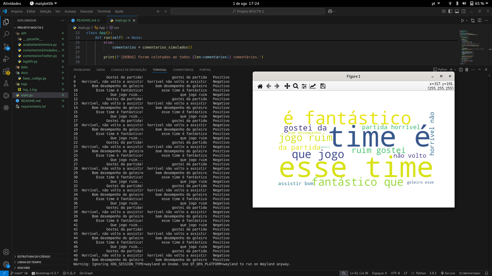
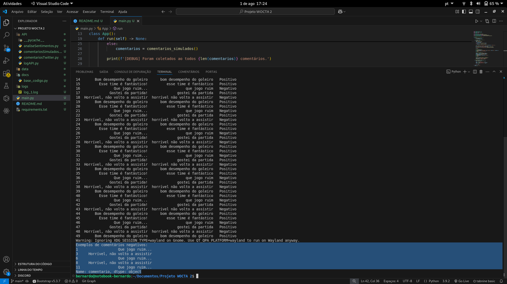

# Documentação Projeto WOCTA

## Análise de sentimentos em comentários de redes sociais sobre futebol usando NLP

### Autores:

- Bernardo de Castro Monteiro Franco Gomes - Estudante de Ciências da Computação na UFSJ | "Se7enzito"

## Contexto

Este trabalho apresenta uma análise exploratória de sentimentos em comentários de redes sociais relacionados ao tema futebol. Foram empregadas técnicas de Processamento de Linguagem Natural (NLP), utilizando bibliotecas Python, para coletar e analisar comentários com o objetivo de identificar padrões de polaridade — positiva, neutra e negativa. A partir dessa análise inicial, os comentários classificados como negativos são destacados, permitindo que sejam encaminhados aos administradores das páginas para avaliação e, se necessário, adoção de medidas cabíveis. Os resultados obtidos foram representados por meio de gráficos e nuvens de palavras, oferecendo uma visão mais detalhada sobre a percepção do público em relação ao tema abordado. A pesquisa demonstra como soluções relativamente simples podem gerar insights relevantes para clubes de futebol, empresas do setor e profissionais da área.

#### Palavras-Chaves

> NLP; análise de sentimentos; futebol; redes sociais; inteligência artificial;

## Objetivo

O futebol configura-se como um fenômeno cultural de grande impacto, sobretudo em um contexto digital cada vez mais polarizado. Nesse cenário, compreender a opinião do público torna-se essencial para dirigentes de clubes, patrocinadores, jornalistas e demais profissionais envolvidos. Os objetivos deste trabalho são: contribuir para que as redes sociais se tornem espaços mais saudáveis e seguros para discussões esportivas; e possibilitar que dirigentes, patrocinadores e jornalistas realizem análises mais precisas sobre os sentimentos e percepções manifestados pelos torcedores.

## Método

A metodologia adotada neste estudo é composta por três etapas principais: coleta de dados, processamento e visualização.

A rede social escolhida para a coleta de dados foi o Twitter, em razão de sua ampla disponibilidade de comentários curtos, organização temática por meio de hashtags e facilidade de acesso via API (ou técnicas de scraping), além de fornecer dados em tempo real.

O processamento dos dados incluiu a remoção de elementos que não agregam significado relevante, como palavras extremamente frequentes, emojis e pontuação — facilitando a interpretação automática pelo computador. Em seguida, os textos foram analisados utilizando a biblioteca TextBlob, que permitiu a classificação automática dos sentimentos em categorias de polaridade.

Por fim, os resultados foram apresentados por meio de gráficos e nuvens de palavras, viabilizando uma compreensão visual e intuitiva das principais tendências identificadas na análise.

## Resultado

Os testes realizados apresentaram resultados satisfatórios, mantendo-se de acordo com as expectativas estabelecidas no início do projeto. O sistema foi capaz de identificar corretamente os diferentes tipos de sentimento nos comentários analisados, classificando 30 comentários como positivos, 20 como negativos e 0 como neutros.

Essa distribuição demonstra que a abordagem proposta é funcional e oferece um panorama geral da percepção do público sobre o tema futebol. Além disso, ao destacar automaticamente os comentários negativos, o sistema facilita a ação de moderadores, administradores de páginas e equipes de comunicação, permitindo uma resposta mais rápida a eventuais críticas ou conteúdos ofensivos.

Por fim, destaca-se que, apesar dos resultados alcançados, algumas limitações foram observadas — como a dificuldade em lidar com sarcasmo, abreviações ou gírias muito específicas do contexto esportivo, o que pode afetar a precisão da classificação em casos isolados.

## Conclusão

Este trabalho apresentou o desenvolvimento de um sistema de análise de sentimentos voltado a comentários sobre futebol, utilizando técnicas de Processamento de Linguagem Natural (NLP). Os resultados obtidos indicaram que a solução proposta foi eficaz na classificação automática de sentimentos, atendendo ao objetivo de fornecer indicadores sobre a percepção do público.

Observou-se, contudo, a necessidade de aprimoramentos, como a adoção de modelos mais robustos treinados especificamente para o idioma português e a ampliação da base de dados analisada. Tais aprimoramentos poderão contribuir para aumentar a precisão da análise e viabilizar aplicações em escala, reforçando o potencial do uso de NLP para monitoramento e apoio à tomada de decisão no contexto esportivo.

## Referências

* Liu, B. (2012).  *Sentiment Analysis and Opinion Mining* . Synthesis Lectures on Human Language Technologies, Morgan & Claypool Publishers.
* TextBlob documentation. Disponível em: [https://pypi.org/project/textblob/](https://pypi.org/project/textblob/)
* Vader Sentiment documentation. Disponível em: [https://github.com/cjhutto/vaderSentiment](https://github.com/cjhutto/vaderSentiment)
* Silva, J. et al. (2019). Aplicação de NLP na análise de sentimentos de torcedores de futebol.  *Revista Brasileira de Computação Aplicada* , 11(2).
* Tweepy documentation. Disponível em: [https://docs.tweepy.org/en/latest/getting_started.html](https://docs.tweepy.org/en/latest/getting_started.html)
* Twitter/X API official documentation. Disponível em: [https://developer.x.com/en/docs/x-api](https://developer.x.com/en/docs/x-api)
* wordcloud. Disponível em: [https://pypi.org/project/wordcloud/](https://pypi.org/project/wordcloud/)
* pandas. Disponível em: [https://pypi.org/project/pandas/](https://pypi.org/project/pandas/)
* matplotlib. Disponível em: [https://pypi.org/project/matplotlib/](https://pypi.org/project/matplotlib/)
* seaborn. Disponível em: [https://pypi.org/project/seaborn/](https://pypi.org/project/seaborn/)

---

# README.md

## 📊 **Análise de sentimentos em comentários sobre futebol usando NLP (Python)**

Este projeto aplica técnicas de Processamento de Linguagem Natural (NLP) para analisar sentimentos de comentários relacionados ao futebol em redes sociais.

Com ele, é possível identificar padrões de polaridade (positiva, neutra e negativa), visualizar resultados em gráficos e nuvens de palavras e gerar insights relevantes para clubes, empresas e profissionais.

### 🧰 **Funcionalidades**

* Coleta de comentários do **Twitter** (via API) ou uso de comentários **simulados**
* Limpeza e pré-processamento dos textos
* Tradução automática dos textos para inglês antes da análise (garantindo melhor entendimento pelo modelo)
* Análise de sentimentos com **VADER** (do NLTK)
* Visualização com **gráficos de distribuição** e **nuvem de palavras**
* Geração de logs numerados para depuração
* Listagem de exemplos de comentários negativos

### 📦 **Estrutura do projeto**

.
├── API/
│   ├── analiseSentimentos.py     # Funções de análise e tradução
│   ├── comentariosTwitter.py     # Coleta real do Twitter
│   ├── comentariosSimulados.py   # Geração de comentários simulados
│   └── logAPI.py                 # Criação e configuração de logs
├── data/
│   └── nltk_data/                # Dados baixados pelo NLTK (vader_lexicon)
├── logs/
│   └── log_1.log, log_2.log...   # Logs de execução numerados
├── main.py                       # Código principal do aplicativo
└── README.md                     # Este arquivo

### ✅ **Pré-requisitos**

* Python 3.8+
* [Tweepy]()
* [NLTK]()
* [Deep-translator](https://pypi.org/project/deep-translator/)
* [Pandas]()
* [Matplotlib]()
* [Seaborn]()
* [WordCloud]()

### ⚙️ **Instalação**

Clone o repositório e instale as dependências:

git clone https://github.com/seuusuario/projeto-futebol-nlp.git
cd projeto-futebol-nlp
pip install -r requirements.txt

### 🚀 **Como executar**

**1.** Baixe os dados necessários do NLTK:

> Isso é feito automaticamente pelo código na primeira execução, salvando em `./data/nltk_data`

**2.** Configure se vai rodar com Twitter ou dados simulados:

No arquivo `main.py`, configure:

self.TWITTER_MODE = False   # False = simulados, True = coleta real

**3.** Execute:

python main.py

Você verá no console:

* Quantidade de comentários coletados
* Exemplos de comentários negativos
* E abrirá janelas com gráficos e nuvem de palavras

### 📌 **Sobre a tradução**

Para garantir que palavras em português sejam corretamente interpretadas pelo VADER (que é otimizado para inglês), o projeto traduz cada comentário antes de analisar.

> Feito com [deep-translator](https://pypi.org/project/deep-translator/) e a API do Google Translator.

### 🪵 **Logs**

* Todos os erros ou problemas são registrados em arquivos numerados na pasta `logs/`
* Exemplo: `logs/log_1.log`

### 🧪 **Exemplos esperados**

| Comentário original               | Sentimento |
| ---------------------------------- | ---------- |
| "Esse time é fantástico!"        | Positivo   |
| "Que jogo ruim..."                 | Negativo   |
| "Gostei da partida!"               | Positivo   |
| "Horrível, não volto a assistir" | Negativo   |
| "Bom desempenho do goleiro"        | Positivo   |

### ✏️ **Como contribuir / ideias futuras**

* Melhorar análise para detectar ironia
* Adaptar VADER para léxico em português
* Usar modelos mais robustos (ex.: transformers)
* Expandir para outras redes (Instagram, YouTube)
* Análise temporal (evolução de sentimentos ao longo do tempo)

### 📄 **Licença**

Este projeto foi desenvolvido como parte de um estudo acadêmico / artigo científico.

Sinta-se livre para usar, estudar e melhorar com os devidos créditos.
